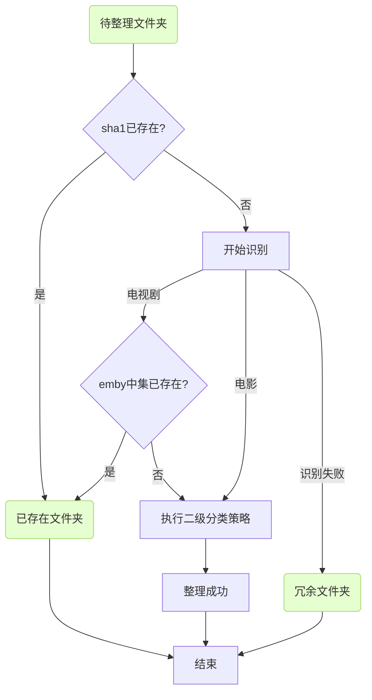

# 自动整理

> [!TIP]
> 帮你整理 115 文件夹里的视频文件，并按照你设置的规则进行重命名和分类到指定文件夹

自动整理必须先执行完成一次全量同步，必须创建好二级分类策略，待整理文件夹必须在媒体库外！不要一次整理太多文件！

## 自动整理流程



## 基础配置

- 待整理文件夹 cid：将你的视频放到这个文件夹，就会自动整理，这个文件夹必须在你全量同步的文件夹外面
- 已存在文件夹 cid：整理时如果该文件被全量同步过，就移动到这里，根据 sha1 判断；如果是剧集，还会去 emby 里判断当前集是否已有
- 冗余数据文件夹 cid：整理之后剩余的数据（识别失败的、不需要处理的）将移动到该文件夹，防止自动任务重复整理

## 重命名规则

用于对视频进行重命名，请先阅读几遍变量说明和语法说明，再开始配置

文件夹命名示例

```yaml
{first_letter}-{ title } - { year } - [(tmdb = { tmdb_id })];
```

文件命名示例

```js
{title}.{year}<.{resource_pix}><.{fps}><.{resource_version}><.{resource_source}><.{resource_type}><.{resource_effect}><.{video_encode}><.{audio_encode}><-{resource_team}>
```

{变量名} 代表变量，取这个变量的值，用尖括号包围的字符串称为 块，块里 {变量名} 表示当 {变量名}不为空时，取块里的内容

自定义命名规则就是自定义多个块，也是多个 <...>，最终这些块的按顺序拼在一块

详细的变量、语法说明请在 cms 里查看

## 二级分类策略

用于对视频进行二级分类，移动到指定的文件夹

二级分类里的文件夹必须是你同步过的文件夹，否则整理时会有文件夹已存在的错误

二级分类策略为 yaml 格式，缩进很重要，同级要对齐；会从上到下依次匹配，匹配到就停止

这里面除了兜底匹配都可以删除，可以根据自己的情况进行删除或增加

::: code-group

```yaml [复杂的二级分类策略]
# 配置电影的分类策略
movie:
  # 分类名仅为标识 不起任何作用
  动画电影:
    cid: 1000000000000000001
    cid123: 123456
    # 匹配 genre_ids 内容类型，16是动漫
    genre_ids: "16"
  华语电影:
    cid: 1000000000000000002
    cid123: 123456
    # 匹配语种
    original_language: "zh,cn,bo,za"
  # 未匹配以上条件时，返回最后一个
  外语电影:
    cid: 1000000000000000003
    cid123: 123456

# 配置电视剧的分类策略
tv:
  儿童:
    cid: 1000000000000000004
    cid123: 123456
    # 10762是儿童
    genre_ids: "10762"
  国漫:
    cid: 1000000000000000005
    cid123: 123456
    genre_ids: "16"
    # 匹配 origin_country 国家，CN是中国大陆，TW是中国台湾，HK是中国香港
    origin_country: "CN,TW,HK"
  日番:
    cid: 1000000000000000006
    cid123: 123456
    genre_ids: "16"
    # JP是日本
    origin_country: "JP"
  纪录片:
    cid: 1000000000000000007
    cid123: 123456
    # 99是纪录片
    genre_ids: "99"
  综艺:
    cid: 1000000000000000008
    cid123: 123456
    # 10764 10767都是综艺
    genre_ids: "10764,10767"
  国产剧:
    cid: 1000000000000000009
    cid123: 123456
    origin_country: "CN,TW,HK"
  欧美剧:
    cid: 1000000000000000010
    cid123: 123456
    # 主要欧美国家列表
    origin_country: "US,FR,GB,DE,ES,IT,NL,PT,RU,UK"
  日韩剧:
    cid: 1000000000000000011
    cid123: 123456
    # 主要亚洲国家列表
    origin_country: "JP,KP,KR,TH,IN,SG"
  其它:
    cid: 1000000000000000012
    cid123: 123456
```

```yaml [简单的二级分类策略]
movie:
  电影:
    cid: 1000000000000000001
    cid123: 123456
tv:
  剧集:
    cid: 1000000000000000002
    cid123: 123458
```

:::

## 洗版策略

你可以设置任意多个洗版策略

- `mode` 是洗版模式，代表你想用哪种策略进行洗版
- `media_type` 设置这个策略用于哪个媒体类型，去掉这个字段即匹配所有
- `category` 设置这个策略用于哪个`分类`（对应于二级分类策略里的分类名），去掉这个字段即匹配所有
- `priority_level` 匹配优先级（就是符合这些规则的视频就会执行这个洗版策略）

优先级匹配支持所有重命名规则里的变量名

```yaml
电影洗版策略:
  mode: replace
  media_type: movie
  priority_level:
    # 匹配 2160p 分辨率
    - resource_pix: "2160p"
    # 匹配 2160p、1080p 分辨率
    - resource_pix: "2160p,1080p"
    # 排除 2160p 分辨率
    - resource_pix: "!2160p"
```

一个通用的新版策略如下：排除 DV；优先 WiKi 小组；优先 2160P

```yaml
# 第一级为别名，随便写
电影洗版策略:
  # 洗版模式：
  #   coexist: 共存（就是多版本共存）
  #   skip: 跳过（就是只要有一个，就不再保存了）
  #   replace:（就是根据优先级进行洗版）
  #   max_size:（就是在优先级相同时保留最大的）
  #   min_size:（就是在优先级相同时保留最小的）
  mode: replace
  # 匹配媒体类型，movie/tv，去掉这个字段即匹配所有
  media_type: movie
  # 匹配二级分类策略的分类名，去掉这个字段即匹配所有
  #category: 华语电影,动画电影
  # 匹配规则优先级，上面的优先级最高
  priority_level:
    - resource_team: "WiKi"
      resource_effect: "!DV"
    - resource_pix: "2160p,4k"
      resource_type: "BluRay"
      resource_effect: "!DV"
    - resource_pix: "1080p"
      resource_type: "BluRay"
    - resource_pix: "2160p,4k"
      resource_type: "WEB-DL"
      resource_effect: "!DV"
    - resource_pix: "1080p"

剧集洗版策略:
  mode: replace
  media_type: tv
  priority_level:
    - resource_pix: "2160p,4k"
      resource_type: "BluRay"
      resource_effect: "!DV"
    - resource_pix: "1080p"
      resource_type: "BluRay"
    - resource_pix: "2160p,4k"
      resource_type: "WEB-DL"
      resource_effect: "!DV"
    - resource_pix: "1080p"

电影兜底策略:
  media_type: movie
  mode: coexist

剧集兜底策略:
  media_type: tv
  mode: skip
```
