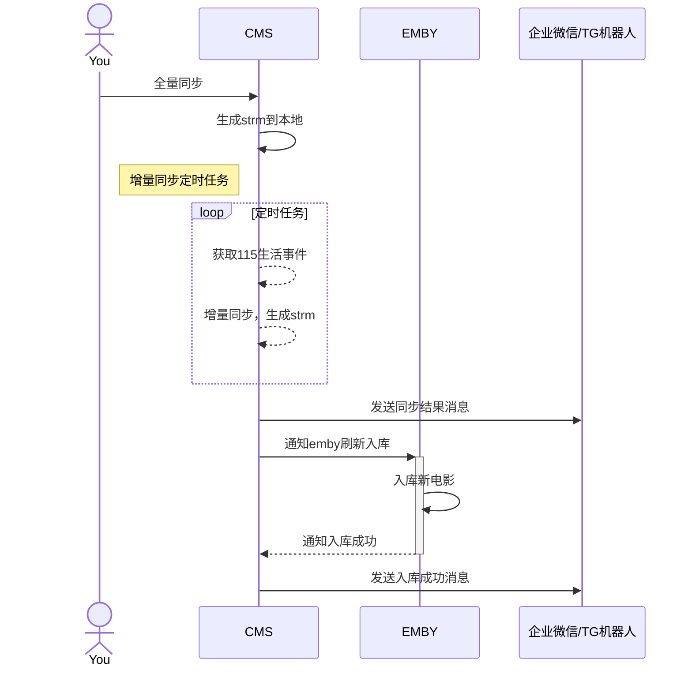
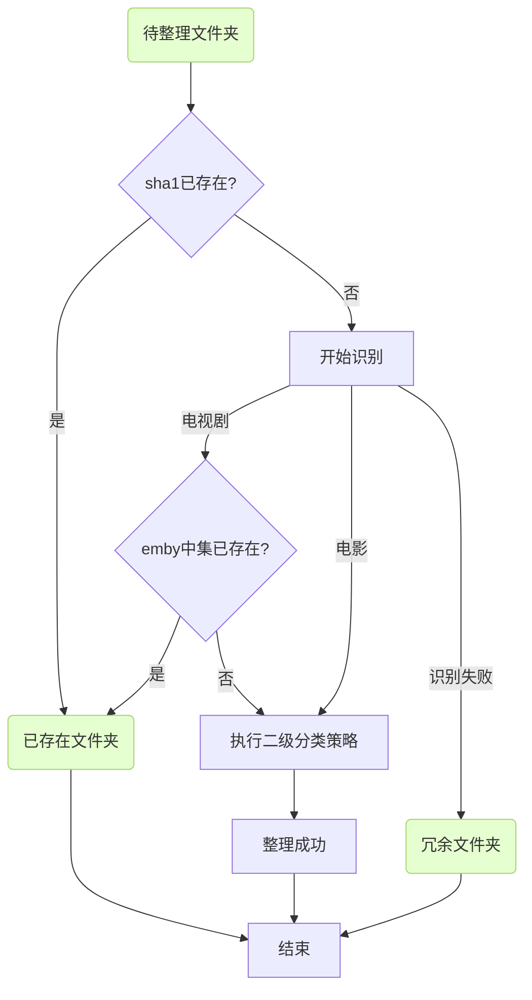
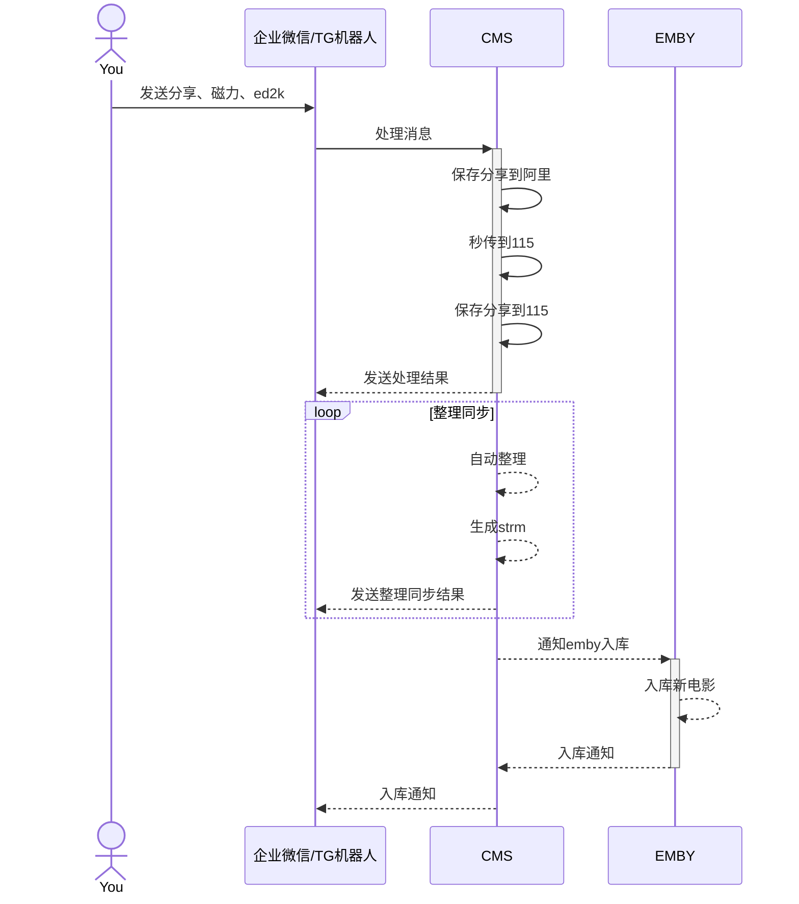

# 功能图解

## 媒体同步

```mermaid
sequenceDiagram
    actor You
    participant A as CMS
    participant D as EMBY
    participant C as 企业微信/TG机器人
    You ->>A: 全量同步
    A ->> A: 生成strm到本地
    Note right of You:增量同步定时任务
    loop 定时任务
        A -->> A: 获取115生活事件
        A -->> A: 增量同步，生成strm
    end
    A ->> C: 发送同步结果消息
    A ->>+ D: 通知emby刷新入库
    D ->> D: 入库新电影
    D -->>- A: 通知入库成功
    A ->> C: 发送入库成功消息

```

## 自动整理

```mermaid
graph TD
    A(待整理文件夹) --> B{sha1已存在?}
    B -->|是| C(已存在文件夹)
    C --> Z[结束]
    B -->|否| D[开始识别]
    D -->|电视剧| G{emby中集已存在?}
    G -->|否| J[执行二级分类策略]
    G -->|是| C
    J --> M[整理成功]
    M --> Z
    D -->|电影| J
    D -->|识别失败| K(冗余文件夹)
    K --> Z
    style A fill:#e6ffd0,stroke:#a3d46b
    style C fill:#e6ffd0,stroke:#a3d46b
    style K fill:#e6ffd0,stroke:#a3d46b
```

## 转存下载

```mermaid
sequenceDiagram
    actor You
    participant A as 企业微信/TG机器人
    participant B as CMS
    participant C as EMBY
    You ->> A: 发送分享、磁力、ed2k
    A ->>+ B: 处理消息
    B ->> B: 保存分享到阿里
    B ->> B: 秒传到115
    B ->> B: 保存分享到115
    B -->>- A: 发送处理结果
    loop 整理同步
    B -->>B: 自动整理
    B -->>B: 生成strm
    B -->>A: 发送整理同步结果
    end

    B -->>+C: 通知emby入库
    C -->>C: 入库新电影
    C -->>-B: 入库通知
    B -->>A: 入库通知
```
